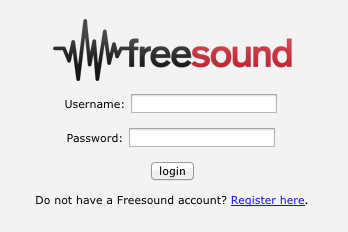
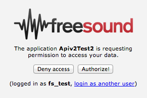
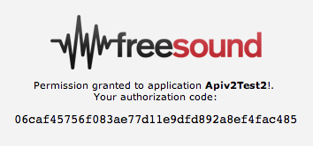

.. _authentication:

Authentication
<<<<<<<<<<<<<<

APIv2 offers two authentication strategies: Token based authentication and OAuth2.

Token based authentication is the simplest one as it only requires the developer to request an API credential
(https://freesound.org/apiv2/apply) and add a provided api key to all requests (see below).
The flow for OAuth2 authentication is a little bit more complicated but it allows users to log in Freesound
from your application. This enables non "read-only" resources such as uploading or rating sounds.
**OAuth2 resources require the requests to be made over https**.
Most of the resources are accessible using both authentication strategies but some of them
are restricted to the use of OAuth2. These resources are marked as "OAuth2 required" in the :ref:`resources` page.

Token authentication
=========================================================

To authenticate API calls with the token strategy you'll need to create a Freesound account (if you don't have one yet!)
and request a new API credential by visiting https://freesound.org/apiv2/apply.
In this page you'll see a table with all API credentials you have requested plus some other information. You should use
the keys in 'Client secret/Api key' column, which are long alphanumeric strings.
You should get a different API key for every application you develop.

Once you have an API key you will need to add it to every request you make to the API. You can do that either by
adding the key as a ``token`` GET parameter...

::

  curl "https://freesound.org/apiv2/search/?query=piano&token=YOUR_API_KEY"

...or by adding it as an authorization header:

::

  curl -H "Authorization: Token YOUR_API_KEY" "https://freesound.org/apiv2/search/?query=piano"

And there we go, that's all you need to know about token authentication!

.. _oauth-authentication:

OAuth2 authentication
=========================================================

To authenticate API calls with OAuth2 you'll also need to create a Freesound account (if you don't have one yet!)
and request a new API credential by visiting https://freesound.org/apiv2/apply. Our OAuth2 implementation
follows the 'authorization code grant' flow described in the RFC6749 (http://tools.ietf.org/html/rfc6749). That flow
basically consists of three steps:

* Step 1: Your application redirects users to a Freesound page where they log in and are asked to give permissions to your application.

* Step 2: If users grant access to your application, Freesound redirects users to a url you provide and includes an authorization grant as a GET parameter*.

* Step 3: Your application uses that authorization grant to request an access token that 'links' the end user with your application and that you will then need to add to all your API requests.

*If your application can't handle requests, the user can also be redirected to another Freesound page that prints the
authorization grant on screen so that the user can manually introduce it in your application (see below).

All these steps and all other further OAuth2 API requests **need to be made over https**.

Step 1
------

You should redirect users to the following url...

::

  https://freesound.org/apiv2/oauth2/authorize/

... including as GET parameters:

======================  =====================================================
Name                    Description
======================  =====================================================
``client_id``           Client id of your API credential (not the client secret!)
``response_type``       Must be 'code'
``state``               (OPTIONAL) Arbitrary string that will be included as a GET parameter in the redirect call.
======================  =====================================================

Example:

::

  https://freesound.org/apiv2/oauth2/authorize/?client_id=YOUR_CLIENT_ID&response_type=code&state=xyz

In this page users will be prompted to log in into Freesound (if they are not already logged in, Fig. 1) and will be asked to give
permission to your application to access their data (Fig. 2).

   Fig 1. Login page (Step 1)

   Fig 2. Permission request (Step 1)

In some situations it might be desirable that users had to login in Freesound (i.e. type their user and password) even if they are already logged in.
If you want to implement this behaviour, you can use an alternative url for Step 1 of the OAuth2 flow which forces a user logout before proceeding to the authorization process.
Therefore, instead of pointing users to ``https://freesound.org/apiv2/oauth2/authorize/`` (and adding the appropriate request parameters),
you should point users to:

::

  https://freesound.org/apiv2/oauth2/logout_and_authorize/?...

Step 2
------

After users either click on "Authorize!" or "Deny access", Freesound will redirect users to a 'Redirect url'
that you specified when requesting the API credentials.
That request will include the following GET parameters:

======================  =====================================================
Name                    Description
======================  =====================================================
``code``                In case user accepts, a ``code`` parameter will be included with a temporary authorization code that you will need to continue with the authentication process.
``error``               In case user denies access to your application, an ``error`` parameter will be included with the value "access_denied".
``state``               This parameter contains the string that you included in Step 1 (only if provided, see above). This string might be useful to indetify requests or user sessions.
``original_path``       This is just a parameter Freesound uses to provide the 'login as another user' option. You can forget about this one ;)
======================  =====================================================

If your application can't handle the request that Freesound does to the 'Redirect url', you can use Freesound itself
as a redirection target when requesting the API credentials. In that case, the redirect will lead to a page where, if
users have granted access to your application, the ``code`` will be displayed on screen so users can easily copy it (Fig. 3).
The url to use Freesound as redirection target will be provided to you when requesting the API credentials.
You will need this code to continue with Step 3 of the authentication process.

   Fig 3. Using Freesound as redirect target (Step 2)

Step 3
------

Once your application gets the authorization code, you can exchange it for an access token that relates your application
with the user that has logged in. You will have to add this access token to all further API calls.

To do that you need to make a POST request to the following url...

::

  https://freesound.org/apiv2/oauth2/access_token/

... including as POST parameters:

======================  =====================================================
Name                    Description
======================  =====================================================
``client_id``           Client id of your API credential (not the client secret!)
``client_secret``       The client secret ;)
``grant_type``          Must be 'authorization_code'
``code``                The authorization code you got in step 2 (see above)
======================  =====================================================

Example:

::

  curl -X POST -d "client_id=YOUR_CLIENT_ID&client_secret=YOUR_CLIENT_SECRET&grant_type=authorization_code&code=THE_GIVEN_CODE" https://freesound.org/apiv2/oauth2/access_token/

The response to that request should look like the following:

::

  {
    "access_token": "64c64660ceed813476b314f52136d9698e075622",
    "scope": "read write read+write",
    "expires_in": 86399,
    "refresh_token": "0354489231f6a874331aer4927569297c7fea4d5"}
  }

Authorization codes obtained in Step 2 have a **lifetime of 10 minutes**, therefore the POST request to get the access token
must be done at most 10 minutes after the authorization code was issued. After that time if an access token is requested
using this code the API will return a 400 (Bar request) response showing an 'Invalid grant' error.
Authorization codes can only be exchanged for an access token **once**, therefore you can not use the same authorization
grant two times to get an access token.

Once you have the access token you will be able to access OAuth2 restricted API resources as described below.

Once you have your access token...
----------------------------------

Every access token relates your application with a Freesound account. Therefore, using this access token your application
can act on users behalf and use all API resources that are restricted to OAuth2 authentication strategy.
To do that you must include the access token in API requests as an authorization header:

::

  curl -H "Authorization: Bearer ACCESS_TOKEN" "https://freesound.org/apiv2/sounds/pending_uploads/"

You can also use this authentication mechanism to access non OAuth2 required API resources.

Similarly to authorization codes, access tokens do have a limited **lifetime of 24 hours**. Notice that access token response
from Step 3 includes an ``expires_in`` parameter that indicates that lifetime in seconds. After that time, the token will
be invalidated and any request to the API using the token will return a 401 (Unauthorized) response showing an 'Expired token' error.
If that happens, you can obtain a new access token either by starting the whole authentication process again or by requesting
a new access token using the **refresh token** that was also issued to you when you got the access token (``refresh_token`` parameter above).

To get a new access token using your refresh token you basically need to repeat Step 3 setting the ``grant_type`` parameter to 'refresh_token'
(instead of 'authorization_code') and adding a ``refresh_token`` parameter with your refresh token (instead of adding the ``code`` parameter
with the authorization code). See the following example:

::

  curl -X POST -d "client_id=YOUR_CLIENT_ID&client_secret=YOUR_CLIENT_SECRET&grant_type=refresh_token&refresh_token=REFRESH_TOKEN" "https://freesound.org/apiv2/oauth2/access_token/"

The response to this request will be a brand new access token that you can use in further API calls. It will also include
a new refresh token that you will need when the newly given access token expires. There can only exist one access token per
application/user pair at once, therefore newly created access tokens overwrite existing ones if they relate the same application/user pair.

Freesound users that have granted access to your application, can revoke this access at any time using their settings page in Freesound.
Revoking the access means invalidating the access token (and refresh token) that was issued to your application.
In that case, attepting to use the access token will result in a 401 (Unauthorized) response showing an 'Invalid token' error.

Managing access tokens and multiple users
-----------------------------------------

If you are developing an application where multiple users
could be logged in concurrently, you'll need a way to also relate your users with the access tokens they have generated.
In that case we recommend to use the OAuth2 authorization flow as a 'Log in with Freesound' service that will allow you to
identify the users of your application and provide access tokens for them. To do that you should follow the standard authorization
flow and then make a call to the :ref:`Me API resource <me_resource>`. With that information your application will find out
who has logged in and will be able to uniquely identify the user.

If the authorization process is well implemented (e.g. using iframes to embed the Freesound login page and handling the
redirect call in your application), the process can be very fast and really transparent to the user, only having to log
in Freesound and clicking the 'Authorize!' button (Fig. 2).
If the user has already a valid session opened in Freesound, she won't even need to log in and will be directly redirected
to the permission request page (unless you use the alternative ``logout_and_authorize`` url in step 1, see above).
And even more, if the user had previously granted permission to your application (if we see that
there exists an either active or expired access token relating your application and the Freesound account), the permissions
will be automatically granted and OAuth2 flow will go directly to the redirection step (Step 2), making the process even faster.

Aaaaaand that is all you need to know about OAuth2 authentication strategy. If you have any further questions or doubts
you can post them in our mailing list http://groups.google.com/group/freesound-api. Suggestions to improve this documentation
are also welcome!

